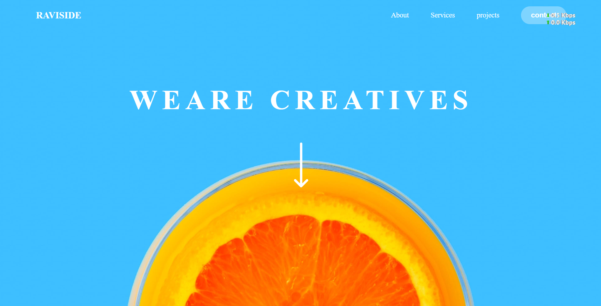
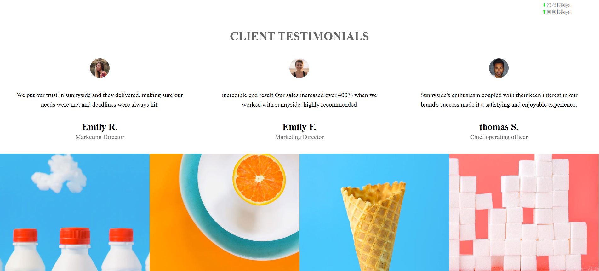

## 🌞 RAVISIDE Landing Page

A modern and responsive creative agency landing page built with HTML, CSS, and JavaScript.
This project showcases clean design, interactive sections, client testimonials, and a responsive gallery footer.

# 📸 Preview
- first pic 


- second pic 


## ✨ Features

- 📑 Responsive Navigation Bar with styled links and a contact button

- 🖼️ Hero Section with background image and call-to-action

- 🎨 About & Services Sections with alternating text + image layout

- 🖼️ Gallery Section with background images

- 📱 Responsive Design for desktop and mobile

- ⚡ JavaScript Enhancements (interactivity and effects)

- 🛠️ Technologies Used

HTML5 → semantic structure

CSS3 → Flexbox, hover effects, responsive design

JavaScript (Vanilla) → interactive behaviors

## 📂 Project Structure
```js
raviside-landing-page/
│── index.html          # Main HTML file
│── style.css           # Stylesheet
│── script.js           # JavaScript functionality
│── assets/
│   ├── images/         # Images & icons
│   └── favicon/        # (Optional) favicon files
└── README.md           # Project documentation
```
## 📖 Usage

Scroll to explore hero, services, testimonials, and gallery sections.

Navigation menu links jump to different sections.

Hover over buttons and nav items to see smooth effects.

# 📌 Future Improvements

✅ Add hamburger menu for mobile nav

✅ Add smooth scroll for navigation links

✅ Implement testimonial slider with JavaScript


# 👨‍💻 Author

> Built by Raviranjan mishra ✨