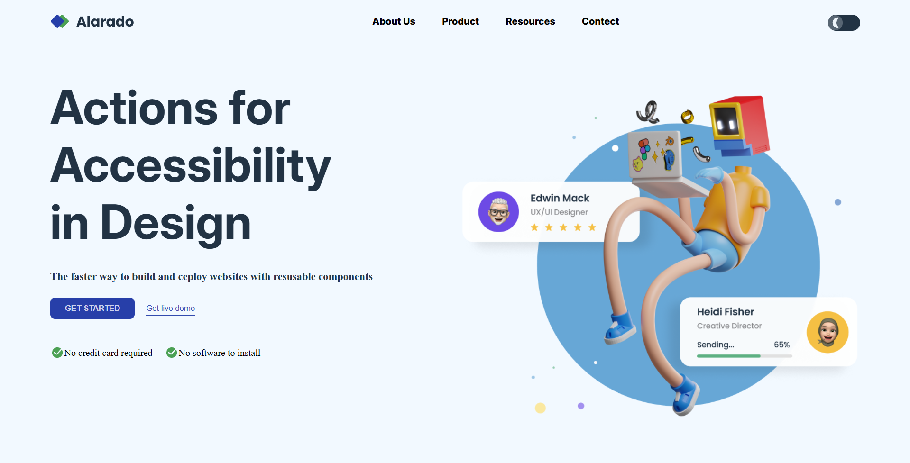
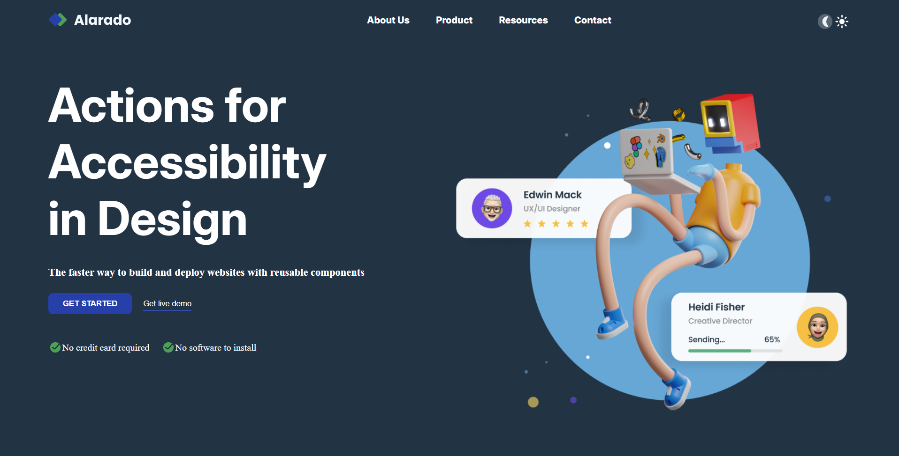

# Accessible Landing Page with Dark Mode Toggle

This project is a **responsive landing page** built with **HTML, CSS, and JavaScript**.  
It includes:
- A responsive **navigation bar** (desktop + mobile).
- A **dark/light mode toggle**.
- A **hero section** with buttons and illustrations.
- Mobile-friendly layout with media queries.

## 📸 Preview
- image1

- dark-image

## ✨ Features
- **Dark/Light Mode**
  - Switch themes using the toggle button (`.round1` for mobile, `.round2` for desktop).
  - Applies color changes across headings, text, and navigation.

- **Responsive Navigation**
  - Desktop: inline navigation menu.
  - Mobile: hamburger menu with open/close functionality.

- **Hero Section**
  - Headline and supporting text.
  - Primary and secondary call-to-action buttons.
  - Feature highlights (“No credit card required” & “No software to install”).
  - Hero image that switches depending on screen size.

- **Accessibility-Oriented**
  - High-contrast dark mode.
  - Large, legible typography.
  - Semantic HTML structure.

## 🛠️ Technologies Used

- **HTML5** – semantic structure
- **CSS3** – responsive design & theme styling
- **JavaScript (Vanilla)** – DOM manipulation for dark mode & mobile nav
- **Google Fonts** – [Inter](https://fonts.google.com/specimen/Inter)

---
## 📂 Project Structure
```js
furniture-store/
│── index.html          // Main HTML file
│── style.css           // Styling for the website
│── script.js           // JavaScript for interactivity
│── assets/
│       ├── images/     // Image files (hero imageslogos, etc.)
│       └── favicon/    // Favicon files
```

## 📌 Future Improvements


- Add a hero image slider with navigation arrows.


- Integrate a backend API for dynamic product data.


- Implement a shopping cart and checkout system.


- Enhance accessibility features for better user experience.

## 👨‍💻 Author

Created by Raviranjan Mishra 🚀
