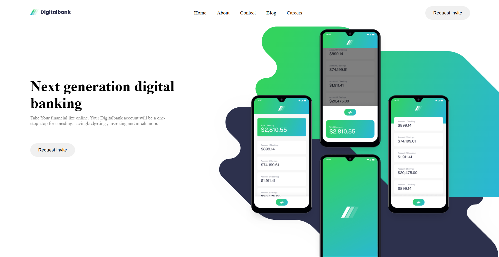
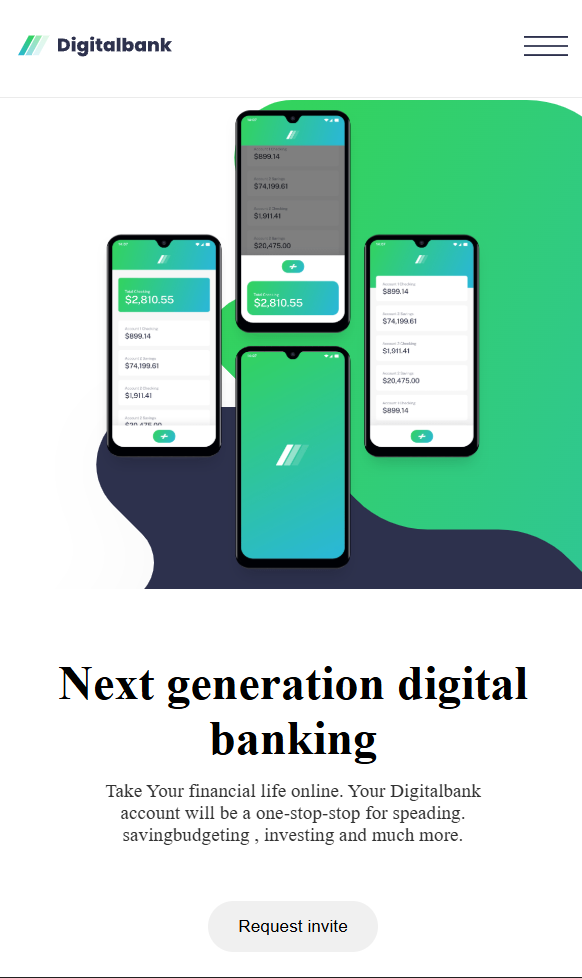

# 💳 DigitalBank Landing Page (Responsive)

This is a modern, fully responsive **landing page** for a fictional digital banking service — **DigitalBank**.  
It is built using **HTML, CSS, and Vanilla JavaScript** with a clean and professional design that adapts perfectly to **desktop, tablet, and mobile** screens.

### 🖥️ Desktop View  


### 📱 Mobile View  


---

## 🚀 Features

- **Responsive Design** – Optimized for all screen sizes (desktop, tablet, mobile).  
- **Interactive Navigation Menu** – Hamburger menu with open/close animations.  
- **Hover Animations** – Smooth hover effects on buttons and cards.  
- **Clean Layout** – Sections for features, articles, and call-to-action.  
- **Modern UI** – Fresh, minimal, and user-friendly design.  

---

## 📂 Project Structure
```js
.
├── index.html          # Main HTML file
├── style.css           # Styling (with media queries for responsiveness)
├── script.js           # JavaScript for menu toggle functionality
└── assets/             # Images, 
```
# 🛠️ Technologies Used
> HTML5 – Semantic and accessible structure

> CSS3 – Styling with Flexbox, Grid & Media Queries

> Vanilla JavaScript – Interactive navigation toggle

## 🎨 Customization
- Replace images inside ./assets/ with your own branding.

- Adjust colors, font sizes, and spacing inside style.css.

- Expand script.js if you want to add more interactivity (like animations, form validation, etc.).

## 📅 Future Improvements
 - Add dark mode support

 - Add form submission with backend support

# 👨‍💻 Author
> Built with ❤️ by Raviranjan Mishra  