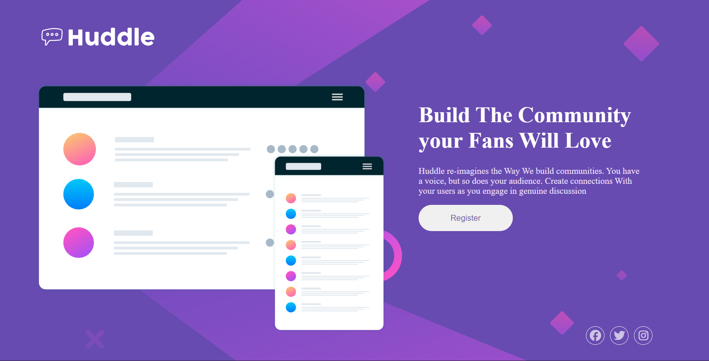
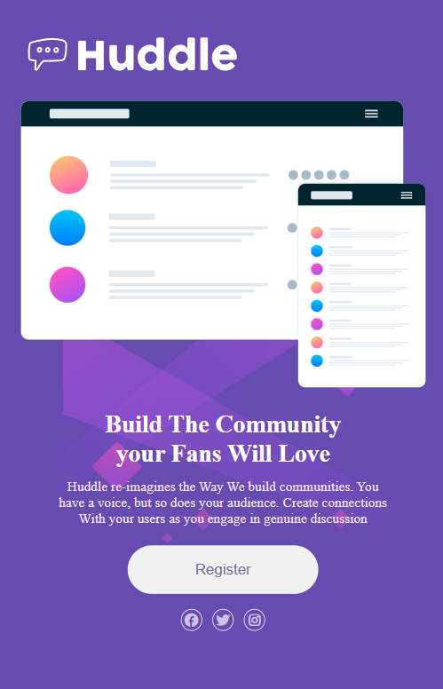

## Huddle Landing Page (Responsive)

- This project is a responsive landing page inspired by Huddle.
It is built with HTML, CSS, and Font Awesome for icons. The design adapts seamlessly to desktop, tablet, and mobile screen sizes.
## 🚀 Live Demo

👉 [Click here to view the project](https://raviranjanmishra01.github.io/html_css_projects/05-huddle-landing-page)
## 📸 Preview

### 🖥️ Desktop View  


### 📱 Mobile View  



## 🚀 Features

- Responsive Design – Works across desktop, tablet, and mobile devices.

- Flexbox Layout – Clean layout with flexible content distribution.

- Custom Buttons & Icons – Hover effects for interactive elements.

- Background Images – Different assets for desktop and mobile views.

- Font Awesome Integration – Social media icons (Facebook, Twitter, Instagram).

## 📂 Project Structure
```js
.
├── index.html         # Main HTML file
├── style.css          # Styling and responsive design
└── assets/
    └── images/        # Contains logo, background, and illustration SVGs
```
## 🛠️ Technologies Used

- HTML5 – Semantic structure of the webpage.

- CSS3 – Styling with Flexbox and media queries for responsiveness.

- Font Awesome 7 – Social media icons.

## 🎨 Customization

- Replace the images inside ./assets/images/ with your own.

- Update colors in style.css to match your branding.

- Add functionality in script.js (currently empty).
### 👨‍💻 Author
Created by ** Raviranjan kumar ** 🚀