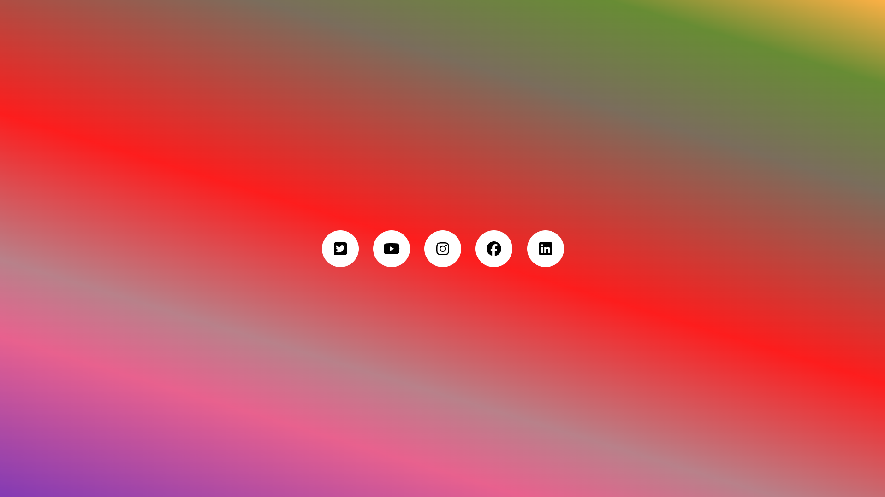
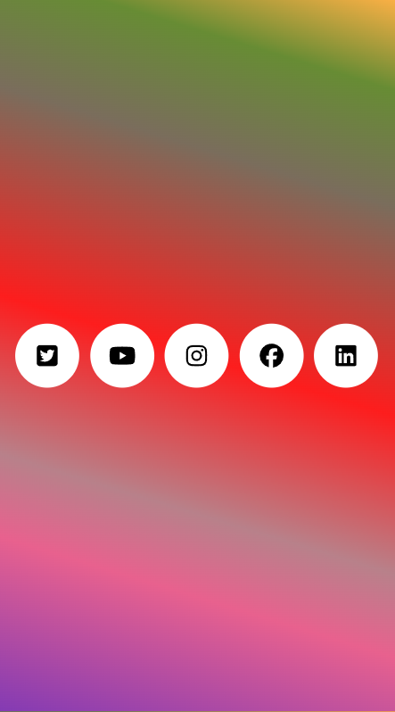

# 🌐 Animated Social Media Icons

A colorful and interactive set of **social media buttons** built with **HTML** and **CSS**.
Each icon animates beautifully with hover effects, tooltips, and color transitions — perfect for use in portfolios, landing pages, or footer sections.

## 🚀 Live Demo

👉 [Click here to view the project](https://raviranjanmishra01.github.io/html_css_projects/11-Animated-Social-Icons)

## 📸 Preview
- Desktop

- Phone

---

## ✨ Features

* 🎨 **Gradient background** for a vibrant modern look
* 🧭 **Hover tooltips** that reveal platform names
* ⚡ **Smooth transitions** and color animations
* 🔵 **SVG-based icons** (scalable and sharp)
* 📱 **Fully responsive layout** using Flexbox
* 💡 No JavaScript required — pure HTML & CSS magic

---

## 🧩 Project Structure

```
animated-social-icons/
│
├── index.html        # Main HTML file
├── style.css         # CSS file for layout and animations
└── (assets)          # (optional) Folder for any extra images or icons
```

---


## 🧠 Technologies Used

* **HTML5**
* **CSS3 (Flexbox, Transitions, Pseudo-elements)**
* **SVG Icons**

---

## 🎨 Color Palette

| Platform  | Color Code |
| --------- | ---------- |
| Twitter   | `#24A3F1`  |
| YouTube   | `#FF0031`  |
| Instagram | `#EB4D7A`  |
| Facebook  | `#106AFF`  |
| LinkedIn  | `#126BC4`  |

---

### 👨‍💻 Author
Created by ** Raviranjan Mishra ** 🚀