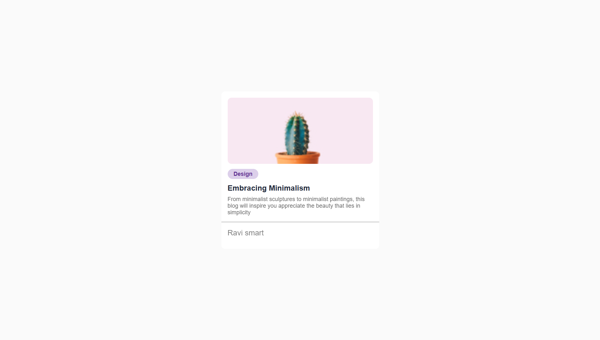

# 🌿 Minimal Blog Card

A clean and responsive blog card component built with **HTML** and **CSS**, designed to showcase minimalist blog previews with elegance and simplicity.
This project demonstrates the power of clean layouts, subtle colors, and modern typography — perfect for design inspiration, portfolio elements, or UI component libraries.

--- 
### 🚀 Live Demo

👉 [Click here to view the project](https://raviranjanmishra01.github.io/html_css_projects/13-Minimal-Blog-Card)
## 📸 Preview


### Desktop



---

## 🧩 Features

* ✨ Minimalist and responsive design
* 🖼️ Image-focused layout with a clean text section
* 📱 Fully responsive down to mobile widths (≤480px)
* 💅 Simple, elegant use of border-radius, shadows, and typography
* 🎨 Great as a building block for blog or portfolio sites

---

## 🧠 Project Structure

``` git
minimal-blog-card/
│
├── index.html        # Main HTML file
├── style.css         # Main stylesheet
└── resources/
    └── Cactus@2x.jpg # Example image for the card

```


## 🧰 Technologies Used

* **HTML5**
* **CSS3 (Flexbox + Media Queries)**

---

## 📱 Responsive Design

This component is mobile-friendly:

* The `.main` card scales to fit smaller screens.
* Font sizes adjust for readability on phones.

---

## 🖋️ Author

**Raviranjan kumar**
Minimalist Design Enthusiast 🌱

